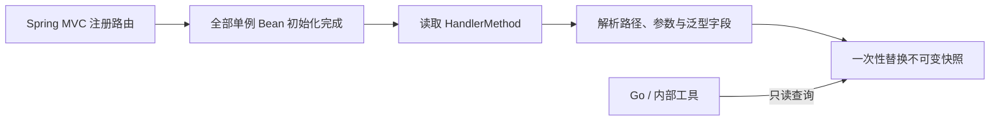

# API Scanner

`api-scanner` 是供 Spring Boot MVC 服务引入的自动配置依赖。应用启动完成后，它读取
Spring 实际注册的 `HandlerMethod`，生成接口路径、HTTP Method、参数注解、请求字段树和
泛型返回字段树，供 Go 服务通过内部 HTTP 接口获取。

它不是独立启动的 Spring Boot 应用，也不扫描源码或 classpath 中的全部类。扫描来源是
`RequestMappingHandlerMapping` 最终确认的运行时路由，因此条件配置未生效的 Controller、
框架内部端点和扫描器自身接口不会进入结果。

## 特性

- Spring Boot 3 自动配置，引入依赖后无需 `@ComponentScan`
- 支持类级与方法级路径合并后的实际路由
- 支持 `PathPattern` 和旧版 `AntPathMatcher`
- 保留参数名、参数注解、媒体类型和泛型返回类型
- 递归展开业务 DTO、父类字段和通用响应包装
- 识别 Collection、Map、Optional、ResponseEntity 等容器类型
- 使用递归路径检测避免循环对象无限展开
- 不可变快照加 `volatile` 引用，查询期间不重复执行反射
- 可选共享 Token，供 DevPilot 等内部工具调用

## 环境要求

- Java 17+
- Spring Boot 3.2.x
- Spring MVC Servlet 应用

## 安装到本地 Maven 仓库

```powershell
git clone https://github.com/BIGLV666/api-scanner.git
cd api-scanner
.\mvnw.cmd install
```

业务服务增加依赖：

```xml
<dependency>
    <groupId>org.example</groupId>
    <artifactId>api-scanner</artifactId>
    <version>0.0.1-SNAPSHOT</version>
</dependency>
```

不需要添加 `@ComponentScan` 或 `@Import`。Jar 中的
`AutoConfiguration.imports` 会自动注册扫描服务与内部 Controller。

## 配置

```yaml
api-scanner:
  enabled: true
  base-path: /internal/api-scanner
  internal-token: ${CODEWISE_INTERNAL_TOKEN:}
```

`internal-token` 为空时不校验，适合纯本地环境。部署环境建议与 Go 服务配置相同 Token，
Go 请求时通过 `X-CodeWise-Internal-Token` 传入。

配置说明：

| Property | Default | Description |
| --- | --- | --- |
| `api-scanner.enabled` | `true` | 是否注册扫描服务和内部 Controller |
| `api-scanner.base-path` | `/internal/api-scanner` | 内部查询接口统一前缀 |
| `api-scanner.internal-token` | empty | 非空时启用请求头 Token 校验 |

## 接口

```text
GET /internal/api-scanner/apis
GET /internal/api-scanner/controllers
GET /internal/api-scanner/controllers/{controllerName}
```

Go 通常只需要调用 `/apis`。返回结构：

```json
{
  "applicationName": "service-question",
  "scannedAt": "2026-08-03T07:20:00Z",
  "controllers": {
    "org.example.QuestionController": [
      {
        "httpMethods": ["POST"],
        "methodName": "createQuestion",
        "paths": ["/api/questions"],
        "consumes": ["application/json"],
        "produces": [],
        "requestParams": [],
        "returnType": {
          "parameterName": null,
          "className": "Result",
          "fullClassName": "org.example.Result",
          "annotations": [],
          "fields": []
        }
      }
    ]
  }
}
```

## Go 客户端结构

```go
type Snapshot struct {
	ApplicationName string               `json:"applicationName"`
	ScannedAt       time.Time            `json:"scannedAt"`
	Controllers     map[string][]APIInfo `json:"controllers"`
}

type APIInfo struct {
	HTTPMethods   []string    `json:"httpMethods"`
	MethodName    string      `json:"methodName"`
	Paths         []string    `json:"paths"`
	Consumes      []string    `json:"consumes"`
	Produces      []string    `json:"produces"`
	RequestParams []ParamInfo `json:"requestParams"`
	ReturnType    ParamInfo   `json:"returnType"`
}

type ParamInfo struct {
	ParameterName *string     `json:"parameterName"`
	ClassName     string      `json:"className"`
	FullClassName string      `json:"fullClassName"`
	Annotations   []string    `json:"annotations"`
	Fields        []FieldInfo `json:"fields"`
}

type FieldInfo struct {
	FieldName     string      `json:"fieldName"`
	FieldType     string      `json:"fieldType"`
	FullFieldType string      `json:"fullFieldType"`
	NestedFields  []FieldInfo `json:"nestedFields"`
}
```

请求示例：

```go
request, err := http.NewRequest(
	http.MethodGet,
	serviceURL+"/internal/api-scanner/apis",
	nil,
)
if err != nil {
	return Snapshot{}, err
}
request.Header.Set("X-CodeWise-Internal-Token", internalToken)

response, err := http.DefaultClient.Do(request)
if err != nil {
	return Snapshot{}, err
}
defer response.Body.Close()

if response.StatusCode != http.StatusOK {
	return Snapshot{}, fmt.Errorf("api scanner returned %s", response.Status)
}

var snapshot Snapshot
err = json.NewDecoder(response.Body).Decode(&snapshot)
return snapshot, err
```

## 扫描生命周期



首次扫描实现于 `SmartInitializingSingleton.afterSingletonsInstantiated()`。刷新时先在局部变量
中完成全部解析，最后替换 `volatile` 快照引用，因此并发查询不会读取到构建一半的数据。

## 字段树规则

- 基础类型和常见 JDK/框架类型不展开内部实现字段。
- `List<T>`、`Optional<T>`、`ResponseEntity<T>` 展开内容类型 `T`。
- `Map<K, V>` 展开 value 类型 `V`。
- `Result<UserDTO>` 会建立 `T -> UserDTO` 泛型绑定后解析包装字段。
- 同一递归路径中再次遇到相同类型时停止该分支，防止循环引用。
- Servlet Request/Response、Session、Principal、BindingResult 等框架参数不会返回给客户端。

## 测试

```powershell
.\mvnw.cmd clean verify
```

集成测试会启动最小 Spring Boot MVC 应用，验证自动配置发现、内部 Token、请求参数名、
参数注解以及泛型请求/响应字段树。

## 使用边界

- 当前输出是内部工具使用的接口元数据，不是完整 OpenAPI 文档。
- 字段名来自 Java 反射，暂不解析 Jackson 的重命名、忽略和自定义序列化规则。
- Token 是轻量内部保护；公网环境仍应通过网关、网络隔离或正式鉴权控制访问。
